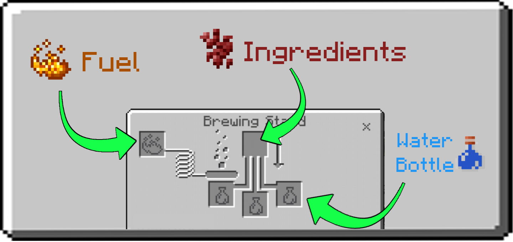
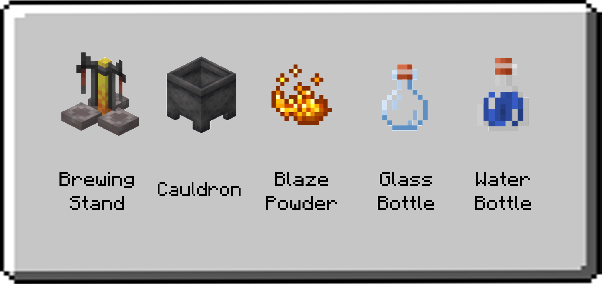
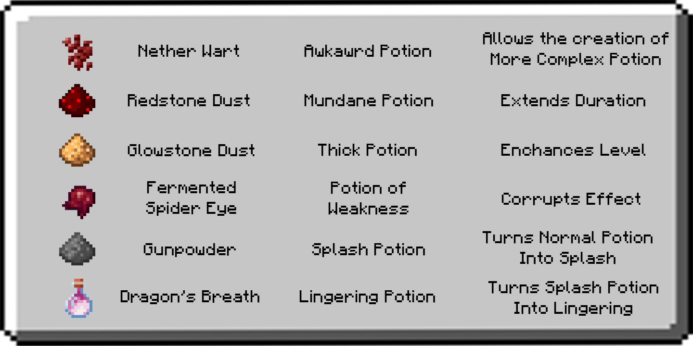
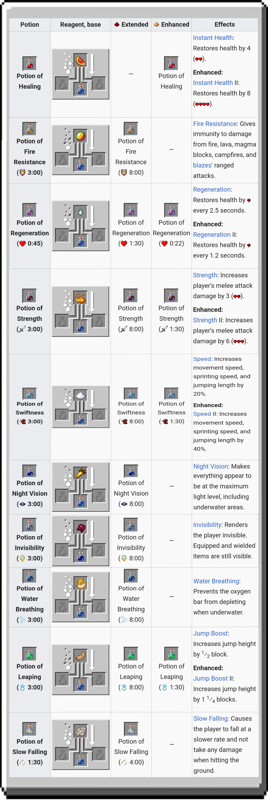

# Brewing Guide
Learn how to brew potions in Minecraft with this Guide

## Introduction
Welcome To Brewing Guide

Brewing is the process of creating potions, splash potions and lingering potions by adding various ingredients to water bottles in a brewing stand.

This guide was made in order to help you how to brew potions in Minecraft, it can also help you when forget some recipes of potions. The Summary section under Ingredients category listed there all ingredients of potions that you can brew.

## Brewing Process

### Brewing Potions

#### Brewing Stand Interface

By placing one or more bottles in the lower three slots of the brewing interface, an ingredient in the upper slot, and blaze powder in the fuel slot, you can distill the ingredient into each bottle and brew potions which may be consumed to grant an effect to the player.

#### Brewing Process

Every potion starts with a water bottle, made by filling a glass bottle at a water source or filled cauldron. Using blaze powder, the next step is to add a base ingredient to create a base potion, usually nether wart to create an awkward potion. By brewing an effect ingredient into the awkward potion in the same manner, the player can create a potion with a working effect.

A modifier ingredient (glowstone dust or redstone dust) may be added to make the effect more intense or last longer or change the effect entirely. Gunpowder can be added to a potion at any stage to convert it to a splash potion, which can be thrown (or fired using a dispenser) to affect all players and mobs in a radius. Dragon's breath can be added to a splash potion to convert it to a lingering potion, which can be used to create a cloud which grants an effect as long as it remains. Each brewing step takes 20 seconds.

Each piece of blaze powder used provides fuel for brewing 20 batches of potions. Fuel is consumed when a brewing operation starts; it is not recovered if the operation is halted prematurely by removing the ingredient or potion bottles.

### Brewing Equipment

#### Uses

Brewing Stand - Used to add ingredients into water bottle/s.
Cauldron - Used for holding a water. Can be fully filled with 1 water bucket or three water bottles. It can fill three glass bottles.
Blaze Powder - It is needed to fuel the brewing stand.
Glass Bottle - Container for all kinds of potions.
Water Bottle - The starting base for all potions, made by filling a glass bottle from a cauldron or water block.

### Brewing Ingredients

#### Base Ingredients and Modifiers

Base ingredients are ingredients which can be added directly to a water bottle and are the starting point of all potions. Nether Wart is the most fundamental of the base ingredients, as it is required to make the vast majority of potions.

Modifiers are ingredients used to alter the properties of a potion, or to change a potion effect into a different one. The fermented spider eye is unique in that it is the only modifier that can convert a water bottle directly into an effective potion.

#### Results and Effect Table

The picture below show the result of certain item when brew with water bottle and its modifier effect. The third row is the result and last row is modifier effect.

#### Corrupting Effect

A fermented spider eye changes a potion's base effect, often reversing it or producing a negative potion.

- A corrupted potion usually does the opposite of the original potion.

- Corrupting an enhanced or extended potion into an effect which supports the modifier results in a potion with the same modifier applied.

- Corrupting an extended potion of Poison results in a basic potion of Harming. Enhanced potions of Leaping or Swiftness cannot be corrupted.

- A potion of Invisibility is considered a **corrupted** version of a potion of Night Vision.

Splash and lingering potions: Any potion can be turned into a splash potion, and subsequently, a lingering potion.

- Splash potions and lingering potions can be modified in exactly the same manner as their normal counterparts. For instance, a splash water bottle can be brewed with any of the base ingredients; the result remains a splash potion.

- Splash potions' effects have only three-fourths of the duration of the drinkable form. For instance, a drinkable potion effect of 8:00 is reduced to 6:00 as a splash potion.

- Lingering potions have only one-fourth of the duration of the drinkable form. For instance, a drinkable potion effect of 8:00 is reduced to 2:00 as a lingering potion.

#### Effect Ingredients

Effect ingredients imbue an awkward potion with a particular effect, but do not alter potion duration or intensity. When added directly to a water bottle, most of these ingredients produce a mundane potion. The exceptions to this are golden carrot, pufferfish, turtle shell, and phantom membrane, which cannot be added directly to a water bottle.

## Brewing Recipes

### Base Potions

Base potions are potions without effects, brewed by adding a single base ingredient to a water bottle. Of these, only the awkward potion can be imbued with an effect ingredient to produce a potion effect.

- Nether Wart turn water bottle to awkward potion and it's precursor to effect potions.

- Redstone Dust are often use to make mundane potion but some recipes can also be added directly to water bottle and turn into mundane potion. These are spider eye, ghast tear, rabbit's foot, blaze powder, glistering melon, sugar and magma cream.

- Glowstone Dust turn water into thick potion, a potion with this base have longer duration of effects of potion.

### Effect Potions

Effect potions are primarily created by adding an effect ingredient to an awkward potion, which is created by adding a nether wart to a water bottle. Certain effects require a potion to be corrupted by a fermented spider eye. The potion of weakness can additionally be created by simply adding a fermented spider eye to a water bottle.

#### Postivie Effects

#### Negative Effects

IMAGE

#### Mixed Effects

IMAGE

### Cure Potions

Cures (Medicine) are brewed from awkward potions using certain elements. These remove the specified effect when drunk. They cannot be modified into splash, lingering, extended, or enhanced versions.

#### Recipes and Effects

IMAGE

### Summary Recipes

IMAGE

